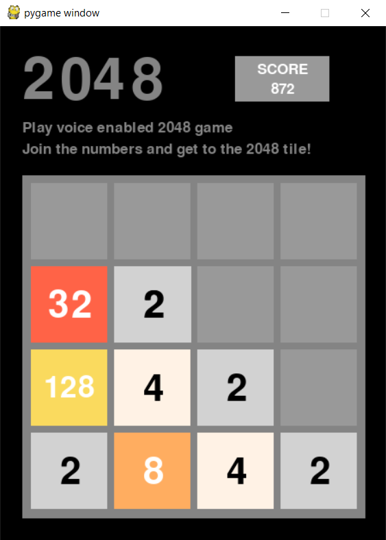

# 2048-Voice-Enabled
Now play the 2048 with voice commands!

You have to use commands - left , right , north and south to move the tiles accordingly.

SAMPLE SCREENSHOT - 



requirements -

```
pip install SpeechRecognition
```

```
pip install pygame
```
